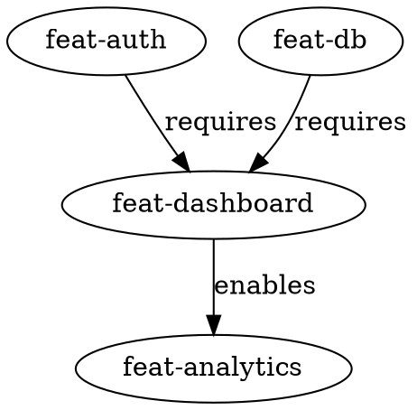

# Design: Chained Proposals

## Overview

This design introduces explicit dependency declarations between change proposals,
enabling a DAG (Directed Acyclic Graph) of proposals that can be validated and
visualized.

## Architecture

### Frontmatter Parsing

Proposal.md files gain optional YAML frontmatter:

```yaml
---
id: feat-dashboard
requires:
  - id: feat-auth
    reason: "needs user model and session management"
enables:
  - id: feat-analytics
    reason: "unlocks event tracking"
---

```

**Parser location**: `internal/domain/proposal.go` (new file)

**Data structure**:

```go
type ProposalMetadata struct {
    ID       string       `yaml:"id,omitempty"`
    Requires []Dependency `yaml:"requires,omitempty"`
    Enables  []Dependency `yaml:"enables,omitempty"`
}

type Dependency struct {
    ID     string `yaml:"id"`
    Reason string `yaml:"reason,omitempty"`
}

```

### Validation Pipeline

**Stage 1: Parse frontmatter** (in discovery or validation)

- Extract YAML block from proposal.md

- Parse into ProposalMetadata

- Store in memory for validation

**Stage 2: Validate during `spectr validate`** (warning level)

- For each `requires` entry, check if change-id exists in archive

- If not archived: emit warning "Dependency 'X' is not yet archived"

- Check for circular dependencies in the DAG

- If cycle detected: emit error "Circular dependency: A → B → A"

**Stage 3: Enforce during `spectr accept`** (error level)

- Same checks as Stage 2, but hard fail instead of warn

- Exit code 1 with clear message listing unmet dependencies

### Archive Detection

**Function**: `IsChangeArchived(changeID, projectRoot) bool`

**Location**: `internal/discovery/changes.go`

**Algorithm**:

1. Glob `spectr/changes/archive/*<changeID>*`
2. For each match, extract the change-id portion after the date prefix
3. Return true if exact match found

### Graph Command

**Command**: `spectr graph [change-id]`

**Output formats**:

- ASCII tree (default)

- DOT format (`--dot`) for Graphviz

- JSON (`--json`)

**Example ASCII output**:

```text
feat-dashboard
├── requires: feat-auth (archived ✓)
├── requires: feat-db (active ⧖)
└── enables: feat-analytics

```

**Example DOT output**:



### Cycle Detection

**Algorithm**: Kahn's algorithm or DFS with coloring

**Implementation**:

1. Build adjacency list from all proposals' `requires` fields
2. Run topological sort
3. If sort fails (cycle detected), trace back to find cycle path
4. Report: "Circular dependency detected: A → B → C → A"

## File Changes Summary

| File | Change Type | Purpose |
|------|-------------|---------|
| `internal/domain/proposal.go` | New | ProposalMetadata type |
| `internal/domain/proposal_test.go` | New | Unit tests |
| `internal/validation/deps.go` | New | Dependency validation |
| `internal/validation/deps_test.go` | New | Unit tests |
| `internal/discovery/changes.go` | Modified | IsChangeArchived |
| `cmd/accept.go` | Modified | Check dependencies |
| `cmd/validate.go` | Modified | Warn on unmet deps |
| `cmd/graph.go` | New | Graph visualization |

## Edge Cases

1. **Self-reference**: `requires: [self-id]` → Error: cannot depend on self
2. **Non-existent ID**: `requires: [unknown-id]` → Warning: dependency not found
3. **Archived proposal with requires**: Valid - archived means dependencies were
   met
4. **No frontmatter**: Valid - backward compatible, no dependencies
5. **Empty requires/enables**: Valid - treated as no dependencies

## Testing Strategy

1. **Unit tests**: Frontmatter parsing, cycle detection, archive detection
2. **Integration tests**: Full validate/accept flow with dependencies
3. **Table-driven tests**: Various frontmatter formats and edge cases
